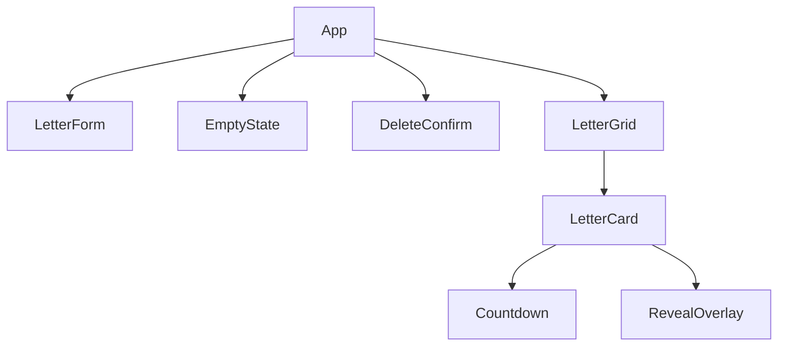

# 🏗 Architecture

This document outlines the technical design and state management of Time-Locked Letters.

## 📄 Data Model: `Letter`

The core data structure is the `Letter` interface:

| Field | Type | Description |
| :--- | :--- | :--- |
| `id` | `string` | Unique identifier generated via `idUtils`. |
| `recipient` | `string` | Display name of the intended reader. |
| `content` | `string` | The message body (locked until `unlockDate`). |
| `unlockDate` | `string` | ISO timestamp when the letter becomes readable. |
| `createdAt` | `string` | ISO timestamp of creation. |
| `status` | `enum` | `locked` \| `unlocked` \| `revealed` |

## 🔄 State Transition Model

1. **Locked**: Default state. Only recipient and countdown are visible. Content is present in memory but hidden by the `LetterCard` overlay logic.
2. **Unlocked**: Automatically triggered when `unlockDate <= now`. The "Seal" becomes clickable.
3. **Revealed**: Triggered after the user clicks "Open Letter" and the animation completes. The content is permanently visible.

## 🪝 Hooks Responsibility

### `useLetters()`
- **Signature**: `() => { letters, addLetter, deleteLetter, updateLetterStatus }`
- **Responsibility**: Manages the master list of letters and ensures atomic synchronization with `localStorage`.

### `useCountdown()`
- **Signature**: `(unlockDate: string, now: number) => { timeLeft, unlocked }`
- **Responsibility**: Computes the human-readable remaining time string and the boolean `unlocked` state.

### `useNow()`
- **Signature**: `(interval?: number) => number`
- **Responsibility**: High-level ticker that provides a shared timestamp to components, preventing drift and excessive re-renders.

## 📦 Component Tree

## 🔐 Security & Persistence
- **Zero Backend**: All data resides in `localStorage`. 
- **Encryption**: No encryption is applied in v1.0. Data is visible to anyone with access to the browser's developer tools.
- **Persistence**: Data survives page refreshes and browser restarts, but is cleared if "Clear Site Data" is used.

## 🕰 Date/Time Strategy
- All timestamps are handled in **ISO 8601** strings.
- Comparison logic in `dateUtils.ts` uses `Date.getTime()` for millisecond precision.
- Countdown polling defaults to **1000ms** to ensure the UI feels "live".
